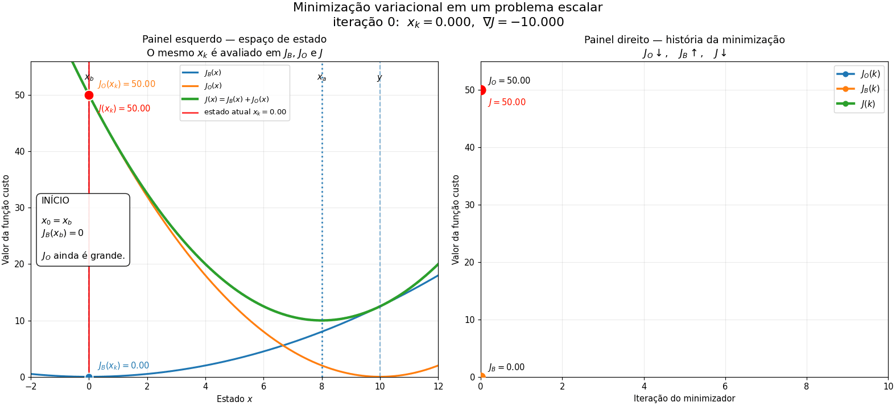

# Minimização variacional: exemplo escalar de $$(J = J_B + J_O)$$

Este repositório contém uma demonstração didática de um dos comportamentos mais importantes da assimilação variacional de dados:

$$
J(x)=J_B(x)+J_O(x)
$$

Durante a minimização, é comum observar

$$
J_O \downarrow,
\qquad
J_B \uparrow,
\qquad
J \downarrow.
$$

Isso **não significa que há um problema com a minimização**. É justamente o comportamento esperado quando o estado inicial é o background e o minimizador modifica esse estado para incorporar informação observacional.



---

## 1. O problema escalar

Para tornar a interpretação transparente, consideramos apenas uma variável de estado $$x$$ e um operador de observação identidade,

$$
H=1.
$$

A função custo é

$$
J(x)=J_B(x)+J_O(x),
$$

com

$$
J_B(x)=\frac{1}{2}\frac{(x-x_b)^2}{\sigma_b^2}
$$

e

$$
J_O(x)=\frac{1}{2}\frac{(y-x)^2}{\sigma_o^2}.
$$

Neste exemplo usamos:

$$
x_b=0,
\qquad
y=10,
$$

$$
\sigma_b=2,
\qquad
\sigma_o=1.
$$

Portanto,

$$
B=\sigma_b^2=4
$$

e

$$
R=\sigma_o^2=1.
$$

Como a observação possui menor variância de erro que o background, a análise deve ficar mais próxima da observação.

A solução analítica é

$$
x_a=\frac{R\,x_b+B\,y}{B+R},
$$

que neste caso fornece

$$
\boxed{x_a=8}.
$$

---

## 2. O que aparece na animação?

A animação possui dois painéis que mostram **o mesmo processo de minimização sob duas perspectivas diferentes**.

### Painel esquerdo — espaço de estado

O eixo horizontal representa o valor do estado escalar $$(x)$$.

São mostradas três funções fixas:

$$
J_B(x),
\qquad
J_O(x),
\qquad
J(x)=J_B(x)+J_O(x).
$$

Essas curvas **não se deslocam durante a minimização**. O que se desloca é o estado atual do minimizador,

$$
x_k.
$$

#### A linha vermelha

A linha vertical vermelha marca exatamente a posição atual do minimizador:

$$
x=x_k.
$$

Ela começa no background,

$$
x_0=x_b=0,
$$

e avança em direção ao mínimo da função custo total, localizado em

$$
x_a=8.
$$

Portanto, a linha vermelha permite acompanhar visualmente

$$
x_b
\longrightarrow
x_1
\longrightarrow
x_2
\longrightarrow
\cdots
\longrightarrow
x_a.
$$

#### A bolinha vermelha

A bolinha vermelha está sobre a função custo total e representa

$$
\boxed{(x_k,J(x_k))}.
$$

Ela é, portanto, a posição do minimizador sobre a curva da função custo.

Durante a minimização, essa bolinha desce por $$(J(x))$$ até se aproximar do seu mínimo.

#### Os outros dois pontos

Na mesma posição horizontal $$(x_k)$$, são mostrados também os valores

$$
J_B(x_k)
$$

e

$$
J_O(x_k).
$$

Isso é fundamental para a interpretação: **os três termos são avaliados no mesmo estado $$x_k$$**.

A linha vertical conecta visualmente

$$
J_B(x_k),
\qquad
J_O(x_k),
\qquad
J(x_k).
$$

Como

$$
J(x_k)=J_B(x_k)+J_O(x_k),
$$

o painel esquerdo permite enxergar diretamente de onde vem o valor da função custo total em cada iteração.

---

## 3. Por que $$J_B$$ começa em zero?

A minimização começa no background:

$$
x_0=x_b.
$$

Assim,

$$
J_B(x_b)=\frac{1}{2}\frac{(x_b-x_b)^2}{\sigma_b^2}=0.
$$

Portanto,

$$
\boxed{J_B(x_b)=0}.
$$

Isso significa que, no início da minimização, o termo de background já está em seu menor valor possível.

Por outro lado, normalmente

$$
y\neq x_b,
$$

de modo que

$$
J_O(x_b)>0.
$$

No nosso exemplo,

$$
J_B(0)=0,
$$

$$
J_O(0)=50,
$$

e

$$
J(0)=50.
$$

---

## 4. O que acontece quando $$x_k$$ começa a andar?

Para reduzir o desajuste com a observação, o minimizador move $$x_k$$ em direção a $$y$$.

Assim,

$$
x_k \rightarrow y,
$$

o que reduz

$$
y-x_k
$$

e, consequentemente,

$$
\boxed{J_O\downarrow}.
$$

Ao mesmo tempo, esse movimento afasta o estado do background:

$$
x_k-x_b
$$

aumenta. Logo,

$$
\boxed{J_B\uparrow}.
$$

O minimizador aceita esse aumento em $$J_B$$ porque a redução obtida em $$J_O$$ é maior. Por isso,

$$
\boxed{J=J_B+J_O\downarrow}.
$$

---

## 5. Painel direito — evolução com as iterações

O painel direito apresenta exatamente os mesmos valores do painel esquerdo, mas agora o eixo horizontal não representa mais $$x$$.

Ele representa a **iteração do minimizador**:

$$
k=0,1,2,\ldots
$$

Assim, são construídas progressivamente três séries:

$$
J_B(k),
\qquad
J_O(k),
\qquad
J(k).
$$

A cada novo passo do minimizador, um novo ponto é acrescentado.

Esse painel é particularmente útil porque se parece com os gráficos de convergência encontrados em sistemas reais de assimilação de dados, como JEDI, GSI e outros sistemas variacionais.

Ao final, vemos claramente:

$$
\boxed{J_O\downarrow}
$$

$$
\boxed{J_B\uparrow}
$$

$$
\boxed{J\downarrow}.
$$

---

## 6. Os dois painéis mostram exatamente o mesmo processo

| Painel esquerdo | Painel direito |
|---|---|
| eixo horizontal = estado $$x$$ | eixo horizontal = iteração $$k$$ |
| mostra onde está $$x_k$$ | mostra a história da minimização |
| $$J_B(x)$$, $$J_O(x)$$, $$J(x)$$ são funções fixas | $$J_B(k)$$, $$J_O(k)$$, $$J(k)$$ são construídos passo a passo |
| linha vermelha mostra $$x_k$$ | cada novo ponto corresponde ao mesmo $$x_k$$ |
| bolinha vermelha mostra $$J(x_k)$$ | curva de $$J$$ mostra a convergência |
| explica geometricamente a minimização | reproduz a leitura típica de um gráfico de convergência |

A conexão central é

$$
\boxed{
x_k
\quad\Longrightarrow\quad
J_B(x_k),\ J_O(x_k),\ J(x_k)
}.
$$

Ou seja: primeiro o minimizador produz um novo estado $$x_k$$; em seguida, os três termos da função custo são avaliados nesse estado.

---

## 7. O algoritmo usado na demonstração

Para que o movimento possa ser acompanhado de maneira simples, usamos gradiente descendente:

$$
x_{k+1}=x_k-\alpha\nabla J(x_k).
$$

Neste problema,

$$
\nabla J(x)=\frac{x-x_b}{B}+\frac{x-y}{R}.
$$

O código usa

$$
\alpha=0.5.
$$

Assim, partindo de

$$
x_0=0,
$$

o primeiro gradiente é

$$
\nabla J(0)=\frac{0-0}{4}+\frac{0-10}{1}=-10.
$$

Portanto,

$$
x_1=0-0.5(-10)=5.
$$

---

## 8. Primeira iteração

No background,

$$
x_0=0:
$$

$$
J_B=0,
\qquad
J_O=50,
\qquad
J=50.
$$

Após o primeiro passo,

$$
x_1=5.
$$

Nesse novo estado,

$$
J_B(5)=\frac{1}{2}\frac{25}{4}=3.125,
$$

enquanto

$$
J_O(5)=\frac{1}{2}25=12.5.
$$

Portanto,

$$
J(5)=3.125+12.5=15.625.
$$

Veja o que aconteceu:

$$
J_B:
0
\rightarrow
3.125,
$$

mas

$$
J_O:
50
\rightarrow
12.5.
$$

Logo,

$$
J:
50
\rightarrow
15.625.
$$

O sistema aceitou um aumento de $$3.125$$ em $$J_B$$ porque obteve uma redução de $$37.5$$ em $$J_O$$.

Esse é o princípio fundamental que a animação procura mostrar.

---

## 9. Aproximação da análise

Nas iterações seguintes,

$$
x_k
$$

continua avançando em direção ao ponto de equilíbrio:

$$
0
\rightarrow
5
\rightarrow
6.875
\rightarrow
7.578
\rightarrow
7.842
\rightarrow
\cdots
\rightarrow
8.
$$

À medida que isso acontece, $$J_O$$ continua diminuindo enquanto $$J_B$$ continua aumentando.

No limite,

$$
x_k\rightarrow x_a.
$$

---

## 10. O que acontece no mínimo?

No ponto ótimo,

$$
\nabla J(x_a)=0.
$$

Como

$$
J=J_B+J_O,
$$

temos

$$
\nabla J_B(x_a)+\nabla J_O(x_a)=0.
$$

Portanto,

$$
\boxed{\nabla J_B(x_a)=-\nabla J_O(x_a)}.
$$

O termo de background tende a puxar a solução de volta para $$x_b$$, enquanto o termo observacional tende a puxá-la em direção à observação.

Na análise, essas duas tendências entram em equilíbrio.

---

## 11. Por que a análise fica mais próxima da observação?

Neste exemplo,

$$
\sigma_b=2,
\qquad
\sigma_o=1.
$$

Logo,

$$
B=4,
\qquad
R=1.
$$

A observação possui menor variância de erro e recebe mais peso.

Por isso,

$$
x_a=8
$$

fica muito mais próximo de

$$
y=10
$$

do que do background

$$
x_b=0.
$$

Se alterarmos $$B$$ e $$R$$, a posição do mínimo da função custo também muda.

---

## 12. Relação com problemas reais de assimilação

Em um sistema real, $$x$$ não é um único número. Ele pode conter milhões ou bilhões de componentes, como temperatura, vento, umidade, pressão e variáveis de superfície.

Nesse caso,

$$
J_B=\frac{1}{2}(x-x_b)^TB^{-1}(x-x_b),
$$

e

$$
J_O=\frac{1}{2}[y-H(x)]^TR^{-1}[y-H(x)].
$$

Apesar da dimensionalidade muito maior, a lógica fundamental permanece a mesma.

O minimizador procura um incremento que reduza suficientemente o desajuste observacional sem produzir um afastamento estatisticamente injustificável do background.

Assim, em gráficos de convergência de sistemas variacionais, é perfeitamente natural observar

$$
J_B\uparrow,
\qquad
J_O\downarrow,
\qquad
J\downarrow.
$$

---

## 13. Relação com a matriz $$B$$

Em dimensões maiores, $$J_B$$ não mede simplesmente uma distância euclidiana entre análise e background.

Ele mede

$$
(x-x_b)^T B^{-1}(x-x_b),
$$

ou seja, uma distância ponderada pela estrutura estatística dos erros do background.

Isso significa que a matriz $$B$$ determina quais incrementos são estatisticamente baratos e quais são caros.

Direções de grande variância em $$B$$ permitem alterações maiores com menor penalização. Direções de pequena variância são mais fortemente penalizadas.

Por isso, ao interpretar uma curva de $$J_B$$ em experimentos reais, estamos observando quanto o sistema está **pagando estatisticamente** para produzir o incremento de análise.

---

## 14. Como executar

Instale as dependências:

```bash
pip install -r requirements.txt
```

Para executar a animação interativamente:

```bash
python scalar_variational_minimization.py
```

Por padrão, cada iteração permanece na tela por 2 segundos.

Para deixar a animação mais lenta:

```bash
python scalar_variational_minimization.py --pause 4
```

Para alterar o número de iterações:

```bash
python scalar_variational_minimization.py --iterations 15
```

Para salvar a animação em GIF:

```bash
python scalar_variational_minimization.py \
    --save-gif figures/scalar_variational_minimization.gif
```

---

## 15. Estrutura do repositório

```text
.
├── README.md
├── scalar_variational_minimization.py
├── requirements.txt
└── figures
    └── scalar_variational_minimization.gif
```

---

## Mensagem principal

> O aumento de $$J_B$$ durante a minimização não representa uma falha. Quando a minimização parte do background, $$J_B$$ começa em seu mínimo. Incorporar a informação observacional exige afastar a análise desse background, aumentando $$J_B$$. Esse afastamento é aceito enquanto produzir uma redução maior em $$J_O$$, levando à redução da função custo total $$J$$.

Em outras palavras,

$$
\boxed{
\text{a análise é o compromisso estatisticamente ótimo entre background e observações}
}.
$$

